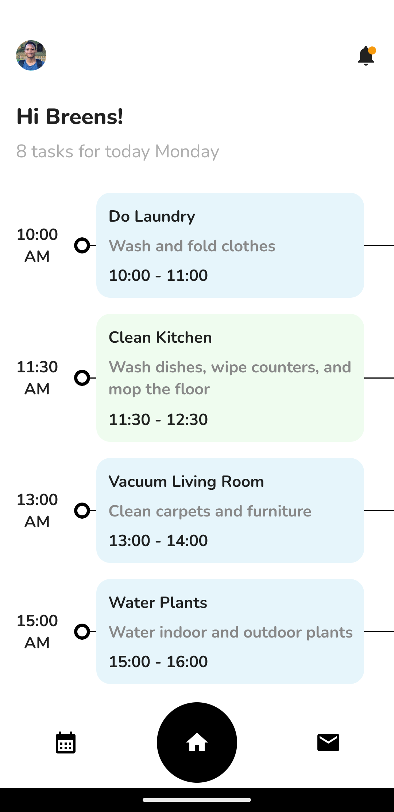

# Jetpack-Compose UI Concepts Implementation
This repository contains all the UI concepts that learners will learn during the Youtube tutorials where they try to implement UI designs 🎨 using Jetpack Compose.

## Task Manager 
This UI design concept was created by [Taras Migulko](https://dribbble.com/shots/18207094-Task-manager-app)

 | {:width="250px"}

# License
```xml
Copyright 2023 BreensMbaka

    Licensed under the Apache License, Version 2.0 (the "License");
    you may not use this file except in compliance with the License.
    You may obtain a copy of the License at

    http://www.apache.org/licenses/LICENSE-2.0

    Unless required by applicable law or agreed to in writing, software
    distributed under the License is distributed on an "AS IS" BASIS,
    WITHOUT WARRANTIES OR CONDITIONS OF ANY KIND, either express or implied.
    See the License for the specific language governing permissions and
    limitations under the License.
```